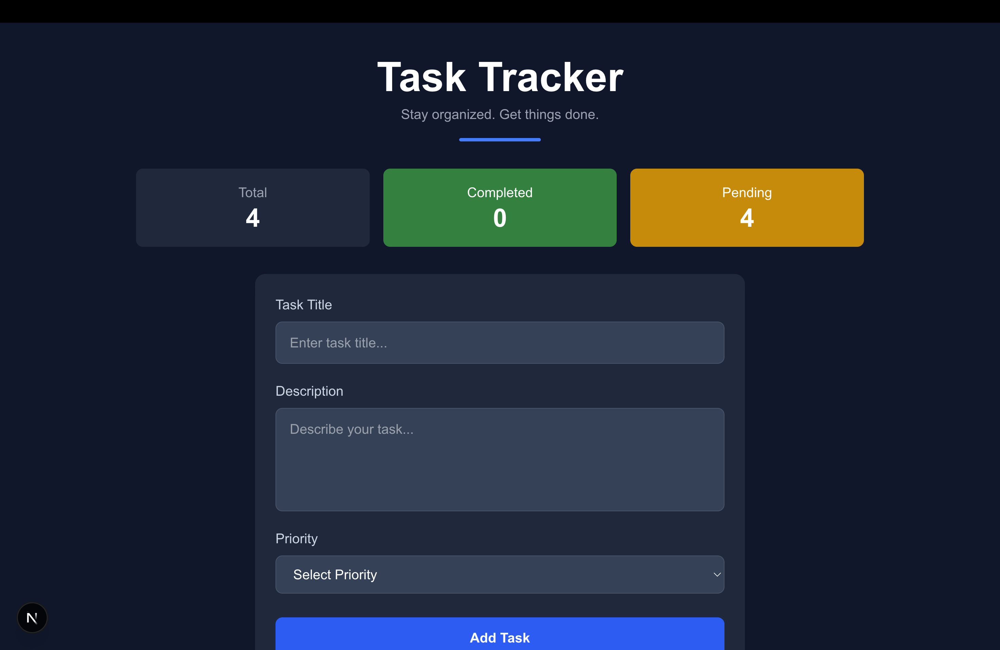
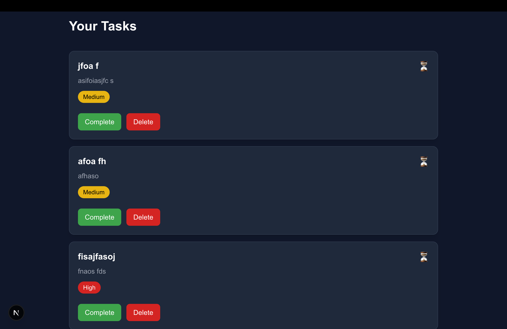
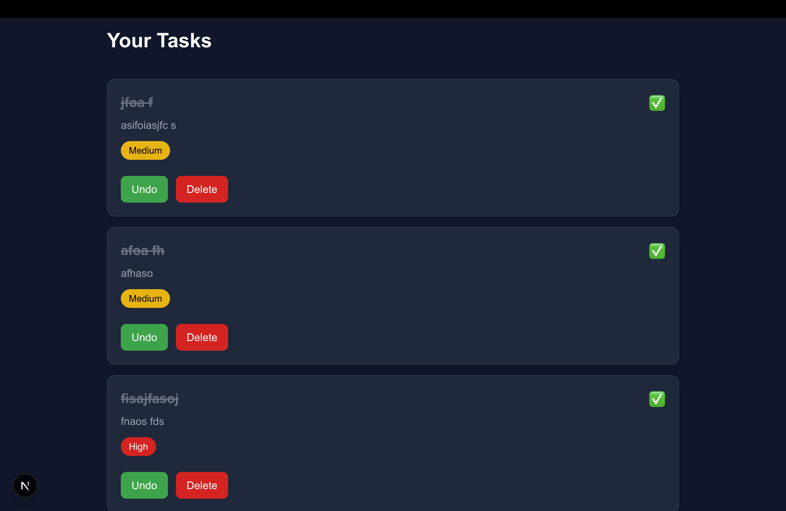

# 📝 Next.js Task Tracker

A modern task management application built with **Next.js**, **React**, and **Tailwind CSS**.

> A project focused on **Component-Based Architecture, React State Management, Client Components, Reusable UI Design, Local Storage Persistence, and Modern Frontend Development Practices.**

---

# 🎯 Project Goal

The primary goal of this project was to strengthen my understanding of **React** and **Next.js** by building a complete CRUD (Create, Read, Update, Delete) application from scratch.

Instead of following a tutorial blindly, I focused on understanding how real-world React applications are structured, how components communicate with each other, and how application state is managed.

During development, I practiced:

- Component-Based Architecture
- React State Management
- Props
- React Hooks (`useState`, `useEffect`)
- Event Handling
- Conditional Rendering
- Local Storage
- Tailwind CSS
- Next.js App Router
- Reusable UI Components

---

# 🌐 Live Demo

Coming Soon...

---

# 📸 Screenshots

## Home Page



## Creating a Task



## Completed Task



---

# ✨ Features

- ✅ Create new tasks
- ✅ Delete existing tasks
- ✅ Mark tasks as completed
- ✅ Undo completed tasks
- ✅ Automatic task statistics
- ✅ Persistent storage using Local Storage
- ✅ Responsive user interface
- ✅ Built using reusable React components
- ✅ Clean and modern UI using Tailwind CSS

---

# 🛠 Tech Stack

- Next.js
- React
- JavaScript (ES6+)
- Tailwind CSS
- HTML5
- CSS3
- Local Storage API

---

# 📂 Project Structure

```text
task-tracker/

│── app/
│
├── components/
│   ├── Header.jsx
│   ├── TaskStats.jsx
│   ├── TaskForm.jsx
│   ├── TaskList.jsx
│   ├── TaskCard.jsx
│
├── globals.css
├── layout.js
└── page.js

│── public/
│── package.json
│── README.md
```

---

# 🧠 What I Learned

Building this project helped me understand modern frontend development using React and Next.js.

## 📌 Component-Based Architecture

- Breaking a large UI into small reusable components.
- Keeping each component focused on a single responsibility.

## 📌 React State Management

- Managing shared application state using `useState`.
- Understanding when state should live in the parent component.

## 📌 Props

- Passing data from parent components to child components.
- Creating reusable and configurable components.

## 📌 React Hooks

- Using `useState` to manage application state.
- Using `useEffect` for Local Storage synchronization.

## 📌 Conditional Rendering

- Rendering UI based on application state.
- Dynamically updating buttons and task status.

## 📌 Local Storage

- Persisting tasks after page refresh.
- Synchronizing React state with browser storage.

## 📌 Tailwind CSS

- Building responsive layouts using utility classes.
- Designing reusable UI without writing custom CSS for every component.

---

# 🚧 Challenges Faced

During development I encountered and solved several interesting problems:

- Managing shared state across multiple components.
- Passing data using props.
- Updating the UI without refreshing the page.
- Synchronizing React state with Local Storage.
- Designing reusable components instead of writing everything inside a single file.
- Structuring a Next.js project using the App Router.

---

# 🔮 Future Improvements

Features I plan to add in future versions:

- 📅 Due dates
- 🔍 Search tasks
- 🎯 Filter by priority
- 🏷 Task categories
- 🌙 Dark / Light mode
- 📊 Progress chart
- ✏ Edit task
- ☁ Cloud database integration
- 🔐 User authentication

---

# 💻 How to Run Locally

Clone the repository

```bash
git clone https://github.com/YOUR_USERNAME/task-tracker.git
```

Go inside the project

```bash
cd task-tracker
```

Install dependencies

```bash
npm install
```

Start the development server

```bash
npm run dev
```

Open

```
http://localhost:3000
```

---

# 👨‍💻 Author

**Aman Prakash Sharma**

- GitHub: https://github.com/Trulyapratim

---

# 📄 License

This project is open source and available under the **MIT License**.

---

⭐ If you found this project helpful, consider giving it a **Star** on GitHub.

---

# 💭 Reflection

This project marked an important step in my transition from building applications with Vanilla JavaScript to developing modern web applications using React and Next.js.

Throughout the project, I learned how to think in terms of reusable components, manage shared state using React Hooks, and organize a project following a scalable folder structure. I also gained practical experience with Next.js App Router, client components, and Local Storage for data persistence.

More importantly, this project strengthened my understanding of how real-world React applications are structured and how multiple components work together to build a complete user experience.